# Graph-Structure

Ovaj fajl je pomoćni prikaz nameravane organizacije. Ne služi kao glavni ulaz u vault; glavni ulaz je `Index.md`.

```mermaid
graph TD
    Root[Index.md] --> CPU[Grana-CPU.md]
    Root --> GPU[Grana-GPU.md]
    Root --> MX[Grana-MIGraphX.md]

    subgraph CPU_Branch
        CPU --> C0[CPU-Standard-Baseline]
        CPU --> C1[CPU-Optimized-Batch-K10]
        CPU --> C2[CPU-Optimized-Batch-K20]
        CPU --> C3[CPU-K20-Fast-findNonZero]
        CPU --> C4[CPU-Secondary-Experiments]
        CPU --> C5[CPU-Low-Resolution-Shortcuts]
    end

    subgraph GPU_Branch
        GPU --> G0[GPU-NMS-Initial]
        GPU --> G1[GPU-NMS-Full-Resolution]
        GPU --> G2[GPU-NMS-Low-Resolution]
        GPU --> G3[GPU-Full-Resolution-PAF]
        GPU --> G4[GPU-Hyperparameter-Tuning]
        GPU --> G5[GPU-Live-Grid-Search]
    end

    subgraph MX_Branch
        MX --> M0[MX-Export-and-Compile]
        MX --> M1[MX-NMS-Validation]
        MX --> M2[MX-Performance-Bottlenecks]
        MX --> M3[MX-ONNX-Feasibility-Boundary]
        MX --> M4[MX-Next-Direction]
    end
```

## Zašto nema direktnih cross-linkova

Neke teme se prirodno ponavljaju u više grana: two-process runtime, latest-frame buffering, accuracy vs throughput i final validation. One nisu direktno linkovane između grana zato što bi Graph View počeo da izgleda kao mreža umesto kao tri jasna eksperimentalna pravca.
